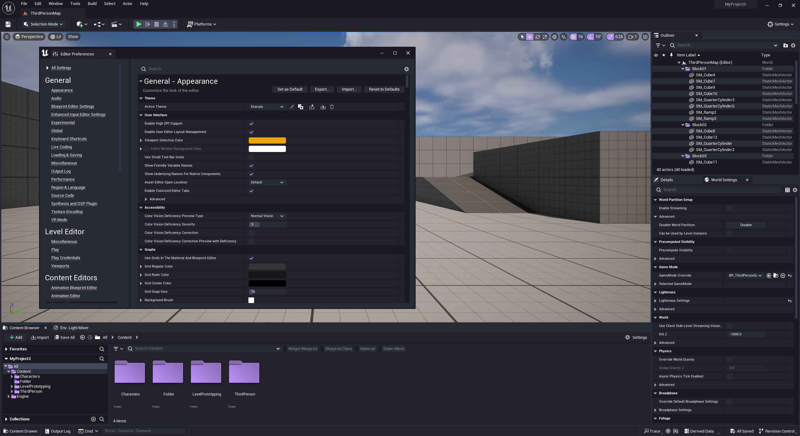

# Dracula for [Unreal Engine 5](https://www.unrealengine.com/en-US/unreal-engine-5)

> A dark theme for [Unreal Engine 5](https://www.unrealengine.com/en-US/unreal-engine-5).

## Install

All instructions can be found at [draculatheme.com/x](https://draculatheme.com/x).

## Team

This theme is maintained by the following person(s) and a bunch of [awesome contributors](https://github.com/dracula/template/graphs/contributors).

 |
--- |
[Jaiden](https://github.com/jaiden-d) |

## License

[MIT License](./LICENSE)
